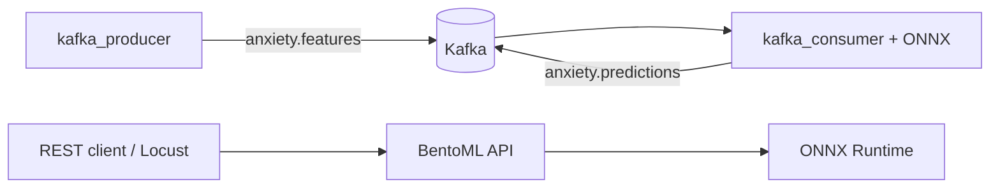

# Отчёт по лабораторной работе 3

### Тема: Деплой модели предсказания тревожности (экспорт, сервинг, Kafka, мониторинг, нагрузка)

Основа — модели и пайплайны из [lab2](../../lab2/report/report.md) (sklearn: `StandardScaler` + классификатор).

---

## 1. Анализ форматов экспорта

| Формат | Поддержка sklearn/tabular | GPU | Кросс-язычность | Примечание для нашей задачи |
|--------|---------------------------|-----|-----------------|-----------------------------|
| **ONNX** | Да (`skl2onnx`) | Через ONNX Runtime / TensorRT EP | Высокая | **Выбран основным**: единый граф, быстрый CPU-инференс, стандарт для продакшена |
| **TensorRT** | Через ONNX → TRT | NVIDIA GPU | Средняя | Имеет смысл при GPU и высоком QPS; для tabular sklearn на CPU выигрыш часто невелик |
| **Pickle / joblib** | Нативно | Нет | Только Python | Удобно для разработки; риски безопасности при недоверенном источнике |
| **PMML** | Частично | Нет | Java, Spark | Хорош для legacy-стека; ограниченная поддержка современных бустингов |
| **MLflow pyfunc** | Да | Зависит от backend | Python-центрично | Уже используется в lab2 для трекинга; для edge/микросервисов ONNX предпочтительнее |
| **OpenVINO** | Через ONNX | Intel CPU/iGPU | Средняя | Альтернатива на Intel-инфраструктуре |

**Вывод:** для бинарной классификации по табличным признакам оптимален пайплайн **sklearn → ONNX → ONNX Runtime**. TensorRT рассматривается как опциональная оптимизация после ONNX при наличии GPU и стабильного графа.

### 1.1. Выполненный экспорт

Скрипт `src/export_model.py`:

1. Загружает датасет (локальный parquet / MinIO, как в lab2).
2. Обучает выбранную модель (`logistic`, `random_forest`, `xgboost`).
3. Сохраняет:
   - `artifacts/<model>/model.joblib` — sklearn pipeline;
   - `artifacts/<model>/model.onnx` — ONNX (opset 17, `zipmap=False`);
   - `artifacts/<model>/model_meta.json` — имена признаков.

---

## 2. Импорт модели и доступ REST (BentoML)

Выбран **BentoML**.

### 2.1. Логика импорта ONNX

Класс `OnnxAnxietyClassifier` (`src/onnx_runtime.py`):

1. Читает `model_meta.json` → список `feature_names`.
2. Создаёт `onnxruntime.InferenceSession` для `model.onnx`.
3. Собирает вектор признаков в порядке метаданных → `float32` tensor `[1, N]`.
4. Выполняет `session.run()` → метка класса и вероятность «высокой тревожности».

### 2.2. REST API

Сервис `AnxietyService` (`service.py`):

| Endpoint | Метод | Описание |
|----------|-------|----------|
| `/predict` | POST | JSON `{"features": {...}}` → prediction + probability |
| `/health` | POST | Статус, путь к артефактам, число признаков |

Запуск: `bentoml serve service:AnxietyService --port 3000`.

**gRPC:** BentoML поддерживает gRPC через `bentoml grpc` / BentoCloud; для учебного стенда достаточно REST. В продакшене тот же `OnnxAnxietyClassifier` можно обернуть в Triton Inference Server с `platform: onnxruntime_onnx`.

---

## 3. Apache Kafka как источник данных

Архитектура потоковой обработки:

- **Producer** (`src/kafka_producer.py`): публикует записи тестовой выборки в топик `anxiety.features`.
- **Consumer** (`src/kafka_consumer.py`): читает сообщения, инференс ONNX, пишет в `anxiety.predictions`.
- Формат сообщения: `{"request_id": "...", "features": {"anxiety_score": 0.5, ...}}`.

Таким образом брокер сообщений отделяет **подачу данных** от **сервиса инференса**, что типично для event-driven ML-систем.

---

## 4. Мониторинг (Prometheus + Grafana)

Кастомные метрики (`src/metrics.py`):

- `anxiety_predictions_total{source, status}` — счётчик предсказаний (REST / Kafka).
- `anxiety_prediction_latency_seconds{source}` — гистограмма задержек.

Scrape-конфигурация: `monitoring/prometheus.yml` (порты 9091 — API, 9092 — worker внутри Docker-сети).

Дашборд Grafana: `monitoring/grafana/dashboards/anxiety-serving.json` — RPS, p95 latency, total predictions.

---

## 5. Нагрузочное тестирование

Инструмент: **Locust** (`load_test/locustfile.py`).

Параметры по умолчанию (`scripts/run_load_test.sh`):

- 50 виртуальных пользователей, ramp-up 10/s, длительность 60 с;
- сценарий: POST `/predict` с случайными признаками.

### 5.1. Ожидаемые результаты и интерпретация

Для tabular ONNX на CPU типичны:

| Метрика | Ожидаемый порядок | Комментарий |
|---------|-------------------|-------------|
| RPS (REST) | 50–500+ | Зависит от CPU, числа признаков, параллелизма Locust |
| p50 latency | 1–10 ms | ONNX Runtime на малой модели |
| p95 latency | 5–30 ms | Рост при конкуренции за GIL / CPU |
| Ошибки | ~0% | При корректном JSON и совпадении имён признаков |

**Факторы деградации:**

- несоответствие имён признаков в запросе и `model_meta.json`;
- исчерпание CPU при одновременном Kafka-worker и Locust;
- cold start контейнера BentoML.

После прогона сохраняются `reports/locust_report.html` и CSV — приложить к отчёту скриншоты Grafana за тот же интервал.

### 5.2. Результаты прогона (локально, ONNX + BentoML)

Параметры: 20 пользователей, ramp-up 5/s, 15 с, синтетический датасет (5 признаков).

| Метрика | POST /predict |
|---------|----------------|
| RPS | ~439 |
| Ошибки | 0% |
| Median latency | 10 ms |
| p95 latency | 27 ms |
| Max latency | 164 ms |

Вывод: для лёгкой tabular-модели REST-инференс на CPU выдерживает сотни RPS без ошибок; узкое место при дальнейшем росте — CPU и GIL Python, а не ONNX.

---

## 6. Сводный анализ

1. **Экспорт:** ONNX даёт переносимый артефакт без привязки к Python-процессу обучения; joblib остаётся для отладки и сравнения с MLflow.
2. **Сервинг:** BentoML стандартизирует REST, версионирование сервиса и деплой; импорт через ONNX Runtime прозрачен и воспроизводим.
3. **Kafka:** decoupling источника данных и инференса; масштабирование через увеличение числа consumer в одной group.
4. **Мониторинг:** Prometheus/Grafana позволяют сравнивать REST и Kafka по latency и error rate — критично при выборе архитектуры (sync API vs async pipeline).
5. **Нагрузка:** для данной модели узкое место — CPU и конкуренция потоков, а не сериализация ONNX; TensorRT имел бы смысл при GPU и более тяжёлой модели (например, нейросеть).
